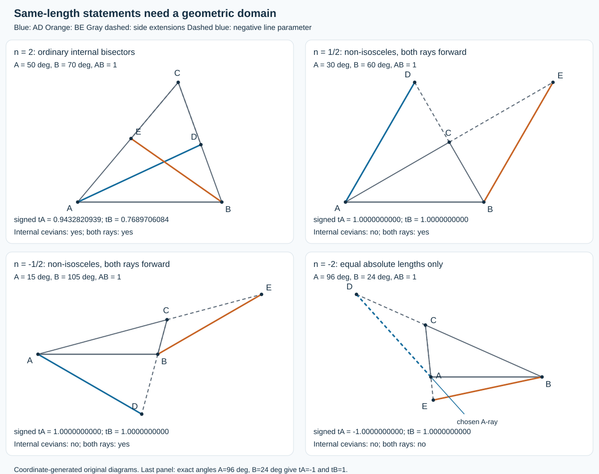
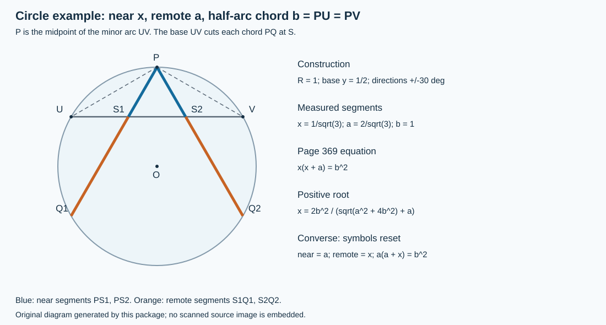

# Sylvester 1852：从等长角平分线走向「反证法是否不可避免」

> 阅读定位：数学与逻辑方法的 AI 前史，不是人工智能论文，也不是已经证明的证明论定理。全文只有四页，却把一个几何定理、参数推广和关于所有证明的猜想放在一起。最重要的阅读动作，是把这三个层次拆开。

## 1. 书目、阅读范围与一句话结论

J. J. Sylvester, **LVIII. On a simple Geometrical Problem illustrating a conjectured Principle in the Theory of Geometrical Method**, *The London, Edinburgh, and Dublin Philosophical Magazine and Journal of Science*, fourth series, 4, no. 26, November 1852, pp. 366–369。作者文末署 **1852 年 10 月 4 日**；这不是发表日。DOI：[10.1080/14786445208647142](https://doi.org/10.1080/14786445208647142)。DOI 元数据把 *simple* 拼成 *simpel*，这里以原刊题名为准。

- [完整原刊，本文从 PDF 第 380 页起](https://archive.org/download/londonedinburghp04maga/londonedinburghp04maga.pdf#page=380)
- [逐页证据、字形与版本账本](sylvester-geometrical-method.sources.zh-CN.md)
- [数学审计](sylvester-geometrical-method.audit.zh-CN.md)
- [原创代码、Notebook、命令与实跑边界](../../reproduction/sylvester-geometrical-method/README.md)

本次读完原刊 366–369 全四页，核对公式、唯一原图、脚注及同卷勘误页。365 页以前与 370 页以后不属于本文。De Morgan 的十二月回应和 Drach 的短评只用于核查这项猜想的同时代解释与接受，不计为两篇额外完成的深读。

**结论先行。** 两条内角平分线等长确实推出等腰；Sylvester 提供的几何与代数论证值得学习。但「排除方程的不可容许根，因此任何纯几何证明必定只能间接进行」跨越了从一个推导到所有推导的鸿沟。原文自己称之为猜测，不能把它写成定理。其参数推广还需要有向长度、交点存在性及除法条件；第 368 页特殊式的可辨字形与前页通式、后面的 90° 例子并不一致。

## 2. 为什么选择这篇：问题背景与有界历史定位

### 2.1 一个看似过分简单的问题

给定三角形，两条从底角出发的内角平分线若等长，是否必为等腰？这是一个「条件对称、结论简单、证明却不顺手」的例子。等腰显然给出相等角平分线，但把这个方向倒过来，并不能只把已有定理的箭头反转。

366 页说，这个问题约一年前在 Cambridge 引起注意，并转述来自 Jesus College 的 B. L. Smith 的证明。作者关于首次出现的说法本身带保留语气；本次没有独立追溯问题最早提出者、所有早期证明或后来命名，因此不把作者的回忆当作优先权裁决。原文使用 Euclid 的三角形比较法、相似三角形、正弦与正切公式；它没有给出一个现代形式化证明系统。

### 2.2 从几何技巧到方法论猜想

文章结构是：两个几何反证 → 比例分角线的三角函数模型 → 小参数下的不等腰解 → 圆弦问题 → 对间接证明必要性与可用性的普遍判据。最后两步，才是它进入逻辑方法史阅读路径的主要理由。

本轮最初核实的是 De Morgan 1852 年十二月的 *On Indirect Demonstration*。其中明确回应前一期 Sylvester，故先读新发现的十一月前驱；不是因为几何名题更有名，也不是把十二月文误当成十一月文的修订。Boole、De Morgan 等更早可得未读书籍，Hamilton 文本与 De Morgan 1847 后期版本对勘仍然开放。这个选择只说明当前有界来源链中的先后，不声称找到了最早的 AI 或逻辑论文。

## 3. 原图、记号与必须先说清的条件

三角形记作 $`ABC`$，底边 $`AB=c\gt 0`$；底角为 $`A=\angle BAC`$、$`B=\angle ABC`$，满足

```math
A\gt 0,\qquad B\gt 0,\qquad A+B\lt \pi.
```

$`D`$ 是从 $`A`$ 发出的分角线与直线 $`BC`$ 的交点，$`E`$ 是从 $`B`$ 发出的分角线与直线 $`AC`$ 的交点。基本问题要求两条**内角平分线**，所以 $`D,E`$ 位于相应边段内部，$`AD=BE`$ 是通常的正长度相等。

366 页的辅助点还包括：$`DF\parallel AB`$，$`F\in AC`$；$`EG\parallel AB`$，$`G\in BC`$；$`H=AD\cap BE`$；$`K=DE\cap AB`$（需要延长时取延长线）。原图是论证示意，不是可供量尺读取的等长实例；若假设非等腰与等长，正是在假设一个最终要被排除的配置。

推广时作者令

```math
A=n\angle BAD=2n\alpha,\qquad
B=n\angle ABE=2n\beta.
```

这里 $`n=2`$ 才是角平分线，$`n=1`$ 是沿三角形两腰到达 $`C`$，$`n=0`$ 对非退化三角形没有定义。负的 $`n`$ 要按有向角解释；$`\alpha,\beta`$ 随之可能为负。小于 1 的正参数可使交点落到边的延长线上。不能一面允许所有延长线、一面仍无条件使用带符号的正弦长度式来代表绝对长度。

为防止混淆，本文区分三种模型：

1. **边段模型**：两条真正的内部 cevian，交点在对边边段。
2. **正向射线模型**：交点可在对边延长线上，但沿指定分角射线的距离必须为正。
3. **无向整直线模型**：允许交点在射线背面，只比较绝对长度。

原来的内角平分线命题属于第一种；推广式首先计算带符号距离，绝不能自动证明第三种模型的普遍结论。



图由附件代码按坐标生成，非原刊图复制。每格都标出交点参数与所属模型；最后一格采用正文的96°/24°精确例子，附件另保留数值求根作为有限搜索的对照。

## 4. 基本几何论证：不相等如何制造矛盾

### 4.1 Smith 证明的可展开部分（366 页）

先假设 $`A/2\gt B/2`$，并同时保留 $`AD=BE=L`$。两交点到 $`AB`$ 的高度是

```math
h_D=L\sin(A/2),\qquad h_E=L\sin(B/2).
```

半角都在 $`(0,\pi/2)`$，故 $`h_D\gt h_E`$，也就是说 $`DF`$ 高于 $`EG`$。三角形被平行于底边的截线所截，越接近 $`C`$ 截线越短，所以 $`DF\lt EG`$。

在三角形 $`AFD`$ 中，$`AD`$ 平分 $`\angle FAB`$，且 $`DF\parallel AB`$，所以 $`\angle FAD=\angle ADF`$，从而 $`AF=DF`$。同理 $`BG=EG`$。于是

```math
AF=DF\lt BG=EG,
\qquad \angle AFD=\pi-A\lt \pi-B=\angle BGE.
```

最后一步可用「两腰等长的等腰三角形，底边随腰长及顶角增大而增大」来展开，而不是只说显然：

```math
AD=2DF\sin\frac{\pi-A}{2}
   =2DF\cos\frac A2
   \lt 2EG\cos\frac B2=BE.
```

这与 $`AD=BE`$ 冲突。交换 $`A,B`$ 同样排除 $`B\gt A`$，故 $`A=B`$。这里写出的正弦/余弦版本是**教学补全**；作者把末步归于 Euclid 的比较命题，没有印出这个计算式。这条具体证明在高度比较时已使用等长假设，再推出不等长，因而是归谬；不能把它未经改造就称作不等角推出不等长的独立直接证明。De Morgan 对逆否形式的另种解释见第 8 节。366 页部分字形可辨为 FBA、FB，但该步骤的对应角与等长对象必须是 EBA、EB；本文按几何对象明确写出教学校核，字形问题见来源账本。

### 4.2 Sylvester 自己的第二个证明（366–367 页）

作者另取 $`H`$ 与外部交点 $`K`$，在假设等长且 $`A\gt B`$ 下，用相似三角形声称

```math
AH:BH=CE:CD.
```

由三角形 $`ABH`$ 的角比较得到 $`AH\lt BH`$，继而 $`CE\lt CD`$，将 $`CDE`$ 的角关系经 $`K`$ 转换，推出 $`\angle ADE\gt \angle ABE`$，并以两个垂距的不可能关系收尾。原文没有画出它所说的整套相似三角形，也把最后的矛盾写得很压缩。

这个证明的重要历史作用是作者认为它便于推广到按比例分角的相等线段；它不是另一套公理化逻辑。下面把最压缩的两处补成可核链条（**教学重构，不是原文逐字证明**）。

令边长 $`a_0=BC,b_0=CA,c=AB`$、周长 $`p=a_0+b_0+c`$。由角平分线定理，

```math
CE=\frac{a_0b_0}{a_0+c},\qquad CD=\frac{a_0b_0}{b_0+c}.
```

$`H`$ 为内心，利用等距于三边和面积分割可得 $`HD/AD=a_0/p`$、$`HE/BE=b_0/p`$，所以

```math
\frac{AH}{BH}
=\frac{AD}{BE}\frac{b_0+c}{a_0+c}
=\frac{CE}{CD}
```

最后一个等号明确用了等长假设，不可误称对任意三角形都成立。

再记半角 $`u=A/2\gt v=B/2`$、$`k=\angle AKD`$、$`t=u-k`$。前面的角链给出 $`t\gt v`$，于是 $`u\gt v+k`$；这些所比较的角都为锐角。对 $`KAD`$ 和 $`KBE`$ 用正弦定理，并用共同的 $`k`$ 和 $`AD=BE`$，得到

```math
\frac{KA}{KE}=\frac{\sin t}{\sin v}\gt 1,
\qquad
\frac{KD}{KB}=\frac{\sin u}{\sin(v+k)}\gt 1.
```

另一方面，在 $`KBD`$ 中用截线 $`A,E,C`$ 的 Menelaus 关系，

```math
\frac{KA}{AB}\frac{BC}{CD}\frac{DE}{EK}=1.
```

因 $`BC\gt CD`$，有 $`KA\,DE\lt AB\,KE`$。加上 $`KA\,KE`$ 并使用 $`KD=KE+ED`$、$`KB=KA+AB`$，得到 $`KA\,KD\lt KB\,KE`$，与上面两个大于 1 的比值乘积矛盾。这样把原文最终的垂距直观替换为明确的边序与比例矛盾，避免只说「显然荒谬」。原垂距说法及推广的范围另见[数学审计](sylvester-geometrical-method.audit.zh-CN.md)。

### 4.3 一个现代代数证明：一般恒等式与有限检查分开

换用通常边长记号 $`a=BC,b=CA,c=AB`$。角平分线长度公式（可由角平分线定理与 Stewart 关系推出）为

```math
\ell_A^2=bc\left(1-\frac{a^2}{(b+c)^2}\right),\qquad
\ell_B^2=ac\left(1-\frac{b^2}{(a+c)^2}\right).
```

两式通分，再把分子按 $`b-a`$ 因式分解，可得

```math
\ell_A^2-\ell_B^2
=\frac{(b-a)c(a+b+c)P}{(a+c)^2(b+c)^2},
\qquad
P=a^2b+ab^2+3abc+ac^2+bc^2+c^3.
```

对非退化三角形，$`a,b,c\gt 0`$ 且满足严格三角不等式；两条角平分线是真实的正长度，右端除 $`b-a`$ 外的因子都严格为正。所以它们等长当且仅当 $`a=b`$。这是**现代教学推导**，不是作者 1852 年所印的证明，也不据此宣称获得了符合作者未定义标准的「纯几何直接证明」。

附件有两种不同强度的复核：用整数系数多项式运算展开两边，验证全部残差系数为零，这是该恒等式的代数证书；另用有限整数边长代入检查实现，它只能帮助发现程序错误。即使恒等式已由系数证书核验，几何结论仍须上述三角形存在性与正性推理；两者都不证明关于所有证明方法的猜想。

## 5. 代数模型：每一步除法都带着几何条件

### 5.1 从正弦定理获得长度

记 $`\theta=A/n`$、$`\phi=B/n`$。以 $`A=(0,0),B=(c,0)`$ 放置坐标，沿两条分角射线的带符号交点参数为

```math
t_A=\frac{c\sin B}{\sin(B+A/n)},\qquad
t_B=\frac{c\sin A}{\sin(A+B/n)}.
```

分母为零时可能是平行或重合，不能返回一个普通有限线段；$`t_A,t_B\gt 0`$ 才是正向射线。等长正向射线满足 $`t_A=t_B`$，于是得到 367 页的式子

```math
\frac{\sin(2n\alpha+2\beta)}{\sin2n\alpha}
=
\frac{\sin(2n\beta+2\alpha)}{\sin2n\beta}.
```

这是把交点长度式交叉比较后的等价形式，不是两个长度本身。数值复核应同时报告原始分母与交点位置；只检测两边相等，可能接受无穷远交点或不属于指定射线的点。

### 5.2 「显然化简」怎样完成

令 $`s=\alpha+\beta`$、$`d=\alpha-\beta`$。交叉相乘的差为

```math
F=\sin((n+1)s+(n-1)d)\sin(ns-nd)
-\sin((n+1)s-(n-1)d)\sin(ns+nd).
```

用和角公式逐项展开并配对：

```math
F=2\left[
\cos((n+1)s)\sin((n-1)d)\sin(ns)\cos(nd)
-\sin((n+1)s)\cos((n-1)d)\cos(ns)\sin(nd)
\right].
```

在要除的因子非零时，$`F=0`$ 才化成原刊的正切商式：

```math
\frac{\tan((n-1)d)}{\tan(nd)}
=
\frac{\tan((n+1)s)}{\tan(ns)}.
```

$`d=0`$ 就是等腰，却会使左边出现 $`0/0`$。作者自己提醒应还原为整式形式后再看这个解。相同提醒也适用于正切极点：某商式没有定义，不等于原来的几何问题没有解。可靠流程是先用无除法的 $`F`$ 筛选，再回到交点和正长度条件。

### 5.3 为什么正常范围内没有不等角解

当 $`n\gt 1`$ 且 $`d\ne0`$，三角形角域给出 $`0\lt |d|\lt s\lt \pi/(2n)`$。左侧正切商严格在 $`0`$ 与 $`1`$ 之间。右侧若 $`(n+1)s\lt \pi/2`$，则大于 $`1`$；若越过 $`\pi/2`$，它为负。恰在极点不能用商式，但代入 $`F`$ 后也不为零。因此正向有限模型中不可能有不等角解。

$`n=1`$ 宜单独处理：两线段都到 $`C`$，相等正是 $`AC=BC`$，不是一个额外神秘定理。$`n=0`$ 不在定义域；$`n=\infty`$ 也不是有限参数。若另取角度趋零的极限，两线段会退到共同底边，不能把这个退化极限误算作严格结论的端点。

对于 $`n=-v\lt -1`$，须保留有向角和正射线要求。若两交点都沿指定射线，正弦分母要求

```math
A/v\lt B\lt vA.
```

令 $`s'=(A+B)/(2v)`$、$`d'=(A-B)/(2v)`$，正向条件进一步给出

```math
\frac{|d'|}{s'}\lt \frac{v-1}{v+1},\qquad
(v+1)|d'|\lt (v-1)s'\lt \pi/2.
```

因此当 $`d'\ne0`$，作者变形中的 $`\tan((v+1)d')/\tan(vd')`$ 大于 $`1`$，而 $`\tan((v-1)s')/\tan(vs')`$ 在 $`0`$ 与 $`1`$ 之间，矛盾。$`n=-1`$ 没有两条有限正向相交分角射线构成的解；等腰时有关直线平行。因此原文「除 $`-1\lt n\lt 1`$ 外都真」的端点，应解释成需要分开检查的退化/空域边界，不能笼统算作和 $`n=2`$ 一样的内部线段定理。

若改用无向整直线，只要求 $`|t_A|=|t_B|`$，则还存在 $`t_A=-t_B`$ 分支。一个完全明确的反例是 $`n=-2,A=96^\circ,B=24^\circ,c=1`$：

```math
t_A=\frac{\sin24^\circ}{\sin(-24^\circ)}=-1,
\qquad t_B=\frac{\sin96^\circ}{\sin84^\circ}=1.
```

两条整直线上的绝对长度相等，但第一交点在指定射线背后，且三角形不等腰。它反驳的是**遗漏方向约束的扩张解释**，不是基本内角平分线命题。审计和代码都单列此分支。

## 6. 小参数、原印不一致与不能随便数的「根」

### 6.1 两个确实可构造的不等腰例子

原文 368 页给 $`n=1/2`$ 和 $`n=-1/2`$。从前页正确通式代入，非零条件下应得

```math
n=\tfrac12:\quad
\frac{\tan(3s/2)}{\tan(s/2)}=-1;
\qquad
n=-\tfrac12:\quad
\frac{\tan(3d/2)}{\tan(d/2)}=-1.
```

扫描中的两个右端可辨为 $`1`$，第二个分子还呈现 $`(3\alpha-\beta)/2`$ 的字形。这里不静默修正：**上式是依据 367 页通式和 368 页数值例子得到的校核式，不是对原字形的忠实抄录；也不是发现了一条作者正式勘误。** 在 $`s=90^\circ`$ 或 $`d=\pm90^\circ`$ 时，正确比值都是 $`-1`$，可立即检测符号差异。详见来源账本。

取 $`c=1`$：

- $`n=1/2,A=30^\circ,B=60^\circ`$。两条分角射线方向都为 $`60^\circ`$，交点分别为 $`D=(1/2,\sqrt3/2)`$、$`E=(3/2,\sqrt3/2)`$，所以长度都是 $`1`$。它们落在对边延长线上；三角形不是等腰。
- $`n=-1/2,A=15^\circ,B=105^\circ`$。此时 $`\alpha=-15^\circ,\beta=-105^\circ`$，故 $`d=90^\circ`$；代入带符号长度式，两者同为 $`1`$。其 $`\phi=B/n=-210^\circ`$ 要以未先截回主值区间的有向角解释，最终射线方向按周期得到 $`30^\circ`$；不能把它误画成普通的小外角。这是合法的扩展射线例子，但绝不是「两条内部角平分线不等腰」的反例。

### 6.2 轨迹脚注与计数问题的边界

368 页第一脚注把这两个参数的顶点轨迹概括为「直线与圆」和「直线与等边双曲线」。其中直线是等腰的垂直平分线候选分支，但是否留下须看方向：$`n=-1/2,A=B`$ 时两参数恒为 $`-c`$，所以正向射线模型把这条分支全部排除；$`n=1/2,A=B`$ 的正向部分要求 $`A=B\lt 60^\circ`$，60° 处平行；$`A+B=90^\circ`$ 对应底边所张直径圆的相应部分；$`|A-B|=90^\circ`$ 则对应相应双曲线分支。以 $`A=(0,0),B=(c,0),C=(X,Y)`$、$`Y\gt 0`$ 写出这三个候选轨迹就是

```math
X=c/2;\qquad
(X-c/2)^2+Y^2=c^2/4;\qquad
(X-c/2)^2-Y^2=c^2/4.
```

后两式分别由 $`\cos(A+B)=0`$ 与 $`\cos(A-B)=0`$ 得到；双曲线的两条渐近线互相垂直，即这里的「等边」。整条代数曲线并不自动等于全部合法三角形，仍须剔除底边端点、共线点、无穷远交点与错误射线方向。

作者进一步询问：给定 $`-1\lt n\lt 1`$ 与角差，允许多少个角和？脚注给一个随倒数区间增长的下界线索：若正整数 $`k`$ 满足 $`1/(2k+1)\lt |n|\lt 1/(2k-1)`$，则所说根数上界至少为 $`k`$（这里把原脚注的整数记号统一改为 $`k`$）。作者未给完整证明或精确分类；端点、原文「给定任意角差」的允许范围都仍需要核定。而且「任给角差都有解」若不加限定就不成立：在 $`n=1/2`$ 时，非等腰有限解要求 $`s=90^\circ`$，所以 $`|d|\ge90^\circ`$ 不能同时满足 $`|d|\lt s`$；在 $`n=-1/2`$ 时，非等腰分支要求 $`d=\pm90^\circ`$，一般固定的其他非零角差没有这样的解。这是对原文存在断言的具体范围反例，不只是尚未运行的数值猜测。本文不替作者补出未写的适用域，也不把有限网格的根计数当作完整答案。角的周期表示、清分母引入的候选及正向射线限制，都影响所谓「可容许根」的总数。

## 7. 圆弦例子：一正一负的根到底说明什么

### 7.1 几何模型与方程的来源（368–369 页）

设 $`M`$ 是圆上一段弧 $`PQ`$ 的中点，因而 $`MP=MQ=b`$。从 $`M`$ 画割线，经端点连线 $`PQ`$ 上的 $`X`$ 后再交圆于 $`T`$。取次序为 $`M,X,T`$，记近段 $`MX=x\gt 0`$、远段 $`XT=a\gt 0`$。问题是：两条这样的割线若远段相等，近段是否相等？

圆周角与 $`MP=MQ`$ 使三角形 $`MPX`$ 和 $`MTP`$ 相似；由对应边可得

```math
MX\cdot MT=MP^2,
\qquad x(x+a)=b^2.
```

因此

```math
x^2+ax-b^2=0,\qquad
x_+=\frac{-a+\sqrt{a^2+4b^2}}2\gt 0,\qquad
x_-=\frac{-a-\sqrt{a^2+4b^2}}2\lt 0.
```

对固定圆与固定基弦，还须 $`h\le x\lt b`$，其中 $`h`$ 是 $`M`$ 到直线 $`PQ`$ 的距离；$`x\gt 0`$ 只给正的代数候选，并不保证任意输入 $`a,b`$ 在该固定图形中都能实现。负根作为代数根完全存在，只是不满足当前 $`M,X,T`$ 顺序下的正长度约定。两条割线具有相同的 $`a,b`$，所以只能选同一个正根。这是原文所谓一个可容许根的具体含义，并不是「方程没有实根」。



图和代码另用 P、U、V 表示本节的 M、P、Q，S 表示 X，图中 Q1、Q2 为各自第二个圆周交点；这是局部记号重置，方程和近远顺序不变。

### 7.2 一个不显式求根的教学重构

若两条近段为 $`x,y\gt 0`$，则

```math
x(x+a)=y(y+a)=b^2
\quad\Longrightarrow\quad
(x-y)(x+y+a)=0.
```

因为 $`x+y+a\gt 0`$，可推出 $`x=y`$。或说 $`f(x)=x(x+a)`$ 在正半轴严格递增，所以同一函数值只能对应同一输入。这个重构不必求出负根，也没有在文字上以「假设结论不成立」开头；但它使用了有序域的消去/正性事实。究竟把其底层规则叫作直接还是间接，依赖预先选定的规则与允许的引理，不能只靠排版形式决定。

### 7.3 为什么逆向问题变成一次式

若已给定的是近段 $`a`$，把远段改记 $`x`$，同一相似关系变成

```math
a(a+x)=b^2,\qquad x=b^2/a-a.
```

369 页原印右端是 $`b^2`$，不是 OCR 易误读的 $`0`$。当 $`b\gt a\gt 0`$ 时，代数远段为正且唯一；若固定圆和基弦，还须近段满足 $`a\ge h`$ 的位置条件；若 $`b=a`$ 得到退化的零远段，若 $`b\lt a`$ 则不符合当前次序。作者据此认为正向问题与逆向问题的证明方法可能存在区别。值得注意的是，两个式子描述同一个几何乘积关系，只是固定量和未知量交换；「次数」已经随问题表述改变。

## 8. 从结果到证明方法：猜想到底跨了哪一步

### 8.1 原文有两个强度不同的主张

368 页的第一层主张是：如果几何命题的解析证明取决于在规定界限内没有可容许实根，那么几何证明只能用归谬。369 页又提出更强的反向愿望：预先承认解析几何语言所依赖的基本命题后，肯定性命题也只有在这类不可容许根情形才需要归谬。合在一起，就仿佛得到何时间接证明「必要且适当」的普遍判据。

原文并未穷举证明，也未给出一个「直接证明」的形式语法。作者使用「相信」「推测」等措辞，甚至邀请读者提供反例。把这一段写成已经建立的不可直接证明性定理，会误报其贡献。

### 8.2 三个不同的量词

1. 「我给出的这个代数推导排除了一个根」是关于**一个表示中的一次推导**。
2. 「目前几何证明都采用间接方式」是关于**当时已知的一批证明**。
3. 「任何纯几何证明都必须间接」是关于**所有可能证明**。

前两点不足以推出第三点。要建立第三点，至少要规定公理、合法推理规则、允许的辅助构造以及直接/间接的可检查定义，再证明所有符合限制的推导都失败。本文并没有完成这样的工作。

### 8.3 方程次数不是语义不变量

同一条件可以引入辅助变量、消元、平方或乘一个额外因子后改写。譬如已知 $`x\gt 0`$ 时，$`x=1`$ 与 $`x^2=1`$ 在该域表达相同解集；后者却多出代数根 $`-1`$，前者没有。若用是否出现须排除的根作为绝对方法判据，必须先解释哪些表示被允许、为何该判据在它们之间保持不变。这个例子是本文的**现代批判性重构**，不是 Sylvester 原文中的反例，也不是对某套正式定义的完整不可能性证明。

### 8.4 同时代 De Morgan 回应的真正分歧

De Morgan 的十二月回应把四类形式分开：直接肯定、直接逆否、以正面反例作归谬、以逆否方向的反例作归谬。他认为 $`A\Rightarrow B`$ 与 $`\neg B\Rightarrow\neg A`$ 的等价转换不应每次都被当作必须重演的几何反证。因此「先证不等角导致不等线」本身可以是直接的逆否论证，而把它转回等长命题所加的归谬，有时只是补充说明。

他并非否认几何命题，也没有交付一份完全符合 Sylvester 自己全部要求的纯几何挑战解；437 页反而说明双方对形式转换的看法不同。这正表明争点首先在「什么算直接」的标准，不能把回应简化为「已经实验推翻所有原定理」。其文署 11 月 1 日，发表于十二月；与 Sylvester 的 10 月 4 日署日及十一月刊期分开记录。

Drach 的同月短评（479 页，署 11 月 22 日）提出通过相互抵消的虚数项理解真假假设与归谬的类比。它是对建议的评论，不是作者勘误，也没有解决证明类别定义与表示不变性问题。此处只记录其与原猜想有关的段落，不扩大成独立深读任务。

## 9. 贡献、局限与今天可借鉴的东西

**真正有价值的贡献**：用一个透明的几何问题把解集、取值域、代数根与证明策略放在一起；发现改变分角参数会改变结论；明确把方法论疑问作为可反驳的猜想提出。四页的价值不在于已拥有完整证明论，而在于让人看见需要形式化什么。

**主要局限**：推广的有向性与边界条件未完全写明；特殊式存在可核的不一致；局部证明压缩了相似和垂距步骤；「直接」没有统一语法；解析表示改变后判据如何保持不变未说明；对所有证明的不可能性没有建立。

**与现代自动推理的联系仅属概念比较**：求解器需要区分代数解与满足几何约束的解，清分母和平方都需要旁条件，检查一个证书与证明不存在任何另一类证书是两种工作。本文没有算法学习、数据集、运行时间评测或机器推理系统；不应把今天的程序复现说成 1852 年作者做过的实验。

## 10. 可复核学习路线与有答案练习

先核来源账本，再手算第 4、5、7 节；运行附件，把每个样例的角域、分母、交点方向与残差一起查看。最后再读猜想与回应，避免拿一个数值输出替代方法论论证。

### 练习 1：为什么不能在正切商中直接代入等腰？

**答案。** $`d=0`$ 使分子分母同时为零；商式失去定义，但无除法的 $`F=0`$ 仍成立。须回到未除去这些因子的等式，并另查线段交点存在性；例如 $`n=-1`$ 的等腰情形仍然退化。

### 练习 2：找出 368 页 90° 示例对字形的最短校核。

**答案。** $`\tan135^\circ/\tan45^\circ=-1`$，所以不能等于原扫描可辨的 $`+1`$。这验证了意图的一致式，不能单凭它断言由作者还是排字者造成，也不能称为正式勘误。

### 练习 3：为什么 $`n=1/2`$ 的反例不反驳角平分线命题？

**答案。** 此时画的是底角两倍的有向角，且交点落在边的延长线上；角平分线对应 $`n=2`$ 并在边段内部。参数与几何域都不同。

### 练习 4：当 $`a=3,b=2`$，圆弦方程有哪些根？

**答案。** $`x^2+3x-4=0`$ 的根是 $`1,-4`$。当前正长度解只有 $`1`$。如果同一个数值对用于逆向模型 $`3(3+x)=4`$，得到 $`x=-5/3`$，不符合正远段；不能因一次方程有实解就称其几何可行。

### 练习 5：是否只需运行很多三角形，就能验证「任何证明都间接」？

**答案。** 不能。采样检验的是选定模型中的数值关系，不枚举证明，也没有定义其直接性。甚至几何普遍定理本身仍需要一般论证，有限采样只能发现反例或实现错误。

### 练习 6：把 $`x=1`$ 改写为 $`x^2=1`$，多出的负根意味着问题更难证明吗？

**答案。** 在 $`x\gt 0`$ 的语义域内，两式解集相同；额外根来自表示变化。它要求我们核对变形的等价条件，并不自动增加对所有证明的限制。

## 11. 阅读后应能复述的五点

- 原定理关于内部角平分线；推广的射线/直线方向不可忽略。
- 正弦式、清分母式与正切商式具有不同的表面定义域。
- 368 页特殊式要保留原字形与校核式的区别，369 页逆向式右端为 $`b^2`$。
- 可容许根取决于几何顺序和不等式；有实根不等于有合法配置。
- 几何定理为真，不等于证明方法猜想已经成立；一个方法排除根，不等于所有方法必须归谬。

**版本说明。** 本篇是原创中文分析与教学重构，不是原文全译或扫描镜像。源图、正式书目信息、解释与实际程序输出分层存放；有限实验、Notebook 执行和独立审计的具体范围见附件。未完成的历史、版本和根数分类问题明确保留。
