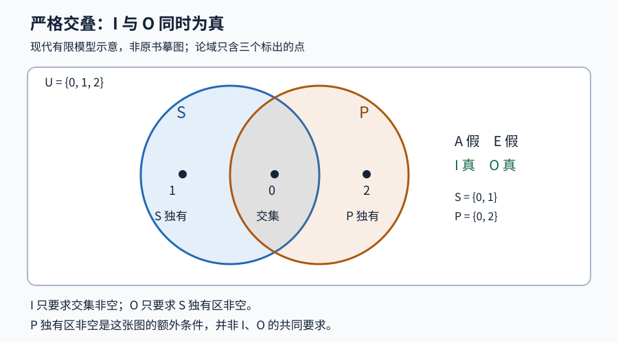

# Euler《致一位德国公主的信》CII：现代有限集合语义小实验

这是为1768年第二卷 Lettre CII（印页95–100，信末署1761-02-14）编写的原创教学程序。它把四类直言命题翻译成现代集合语义，帮助检查图形所表示的条件。**不是对 Euler 全部历史逻辑的重建，不处理三段论，也不替代原文精读。** 程序、测试、数据生成均只用 Python 标准库；无需 Notebook、联网或安装软件包。

## 先运行

要求 Python 3.10 或以上。进入本目录后运行：

```sh
python3 run.py
```

命令先运行全部测试，再生成 `results/results.json`、`results/models.csv`、`results/summary.txt` 和 `results/strict-overlap.svg`。实际解释器、平台、UTC时间与测试命令写入 `results/environment.json`，测试的原始输出写入 `logs/tests.log`。各次运行会覆盖这些生成物。也可单独运行：

```sh
python3 -m unittest discover -s tests -v
```

## 语义和两种模式

固定一个非空有限论域 U，S 是主词的外延，P 是谓词的外延；二者均为 U 的子集。这里的 A/E/I/O 是现代常用标记，**集合公式和布尔判定是本复现选择的解释层，不声称原书给出了现代公理系统**。

| 形式 | 读法 | 程序判定 |
|---|---|---|
| A | 所有 S 都是 P | `S <= P` |
| E | 没有 S 是 P | `not (S & P)` |
| I | 有些 S 是 P | `bool(S & P)` |
| O | 有些 S 不是 P | `bool(S - P)` |

两个容易误读的地方：

- A 是一般包含，包括 S 与 P 相等；不是严格包含。S=P={0} 就同时满足 A 和 I。
- I 的“有些”只意味着“至少一个”，不含“但不是全部”。O 则单独断言 S 中至少有一个不在 P。

本程序区分：

1. `allow_empty_terms`：U 非空，S 或 P 可以为空。S 为空时 A 和 E 都真，I 和 O 都假。
2. `nonempty_terms`：U、S、P 都非空。此时 A 蕴涵 I，E 蕴涵 O。

两者是明确的现代实验选项；不以第二种模式断言 Euler 在本信已经解决全部存在预设问题。全称命题推出相应特称命题其实只需 S 非空；本模式额外要求 P 非空，以便同一对项都在非空约定之下讨论。论域本身为空的情况不在两种模式中。

原文全称否定印作“Nul A n’est pas B”；本次按该信上下文的相离图意读为 E，不机械地用现代字面双重否定改写。程序的集合名 S/P 用来避免把原文项名 A/B 与命题类型 A 混淆。

## 四个原子与小模型界限

把 U 分成四个互不相交的区域：S∩P、S∖P、P∖S、U∖(S∪P)。程序依此顺序用第0、1、2、3位记录各区是否非空。因此数字掩码7表示前三个区域非空、两者以外为空。常规二进制字符串从高位写起，与这里按原子顺序解释位的次序不同，请以列名为准。

四个区域有16种空/非空组合，去除 U 为空的组合后剩15种；再要求 S、P 都非空后剩10种。每个非空区域取一个代表元素，得到至多4元素的典范模型。

这个界限为什么够用？A 只看 S∖P 是否为空；E/I 只看 S∩P 是否为空；O 只看 S∖P 是否非空。压缩每个非空原子的元素个数，不改变这些命题的真值，也不改变两种模式的准入条件。按结构归纳，它也不改变这些四个固定命题的任意命题布尔组合。因此，这些公式若有模型或反例，就有一个至多4元素的模型或反例；检查全部准入位模式即可判定这里定义的后承关系。对纯 A/E/I/O 真值而言，某些位模式彼此等价，四元素界限是易证明的统一上界，并非最小界限。

**界限只针对固定的一对 S/P 及这里定义的语义。** 不覆盖计数、“至少两个”、其他谓词、关系、模态、时态，也不是历史三段论体系的可靠性或完备性证明。有限枚举测试本身不证明任意大模型；上述压缩论证才是把枚举推广到任意模型大小的理由。若考虑无限外延，同样的四原子压缩也保留此片段真值；程序只构造有限对象。

## 实际结果与怎样读图

| 模式 | 位模式总数 | A 真 | E 真 | I 真 | O 真 | 严格交叠模式 |
|---|---:|---:|---:|---:|---:|---:|
| 允许空项 | 15 | 7 | 7 | 8 | 8 | 2 |
| S、P均非空 | 10 | 4 | 2 | 8 | 6 | 2 |

计数对象是**四个区域的非空位模式**，不是所有具体集合模型的数目或概率。严格交叠的2种模式只在“两圆以外是否非空”上不同。

两种模式中 A/O 互为矛盾，E/I 互为矛盾。允许空项时，不同的单一命题类型之间没有普遍成立的蕴涵。非空项时，除了自身蕴涵自身，恰有 A→I 与 E→O。全部32个单前提判断（4×4×2）及无效判断的最小规模反例写在 JSON 中。



图中 U={0,1,2}、S={0,1}、P={0,2}：I 与 O 同时为真，A 与 E 都假。三个点是论域中仅有的对象；圆内部的连续几何点不算新对象。图为现代原创重绘，不是原版扫描复刻。

这张严格交叠图对 I、O 都成立，但不是它们各自唯一的模型：

- S=P={0} 满足 I，而 O 假，两个集合完全重合。
- S={1}、P={2} 满足 O，而 I 假，两个集合完全相离。
- S={0,1}、P={0} 同时满足 I 和 O，却是 P 真包含于 S，没有 P 独有区。

所以即便要求 I 与 O 一起成立，也不能推出严格交叠图中“P 独有区非空”这个额外条件。CIII关于特称图不唯一的后续说明只作为篇界提示；本程序不据此把 CIII 算入已读范围。

## API

```python
from euler_semantics import Model, Mode, counterexample

m = Model({0, 1, 2}, {0, 1}, {0, 2})
print(m.truth())  # {'A': False, 'E': False, 'I': True, 'O': True}

bad = counterexample(["A"], "I", Mode.ALLOW_EMPTY_TERMS)
print(bad.as_dict())  # 一个S为空的单元素论域反例
assert counterexample(["A"], "I", Mode.NONEMPTY_TERMS) is None
```

`counterexample` 接受同一 S/P 上的零个或多个肯定形式作为前提；返回满足全部前提且否定结论的最小元素个数典范模型，或在该片段中有效时返回 `None`。矛盾前提没有模型时也返回 `None`，其含义是语义后承中的空真，不是证明前提一致。若最小反例有多个，以数值掩码较小者优先。此 API 并未实现任意布尔公式的解析器；理论界限比这个简洁接口更宽。

## 测试和产物

- 边界测试：空主词、空谓词、相等、真包含、相离、严格交叠、错误输入。
- 穷举交叉检查：U大小1至4的全部340个带标签模型，其中284个 S/P 均非空；按逐元素量词实现的 oracle 检查集合实现，并验证压缩保真。
- 后承测试：16种前提子集×4个结论×2种模式，共128个查询，与带标签模型的量词判定对照，并检查反例规模最小性。
- 四原子确实分割论域、精确计数、矛盾关系与全部单前提蕴涵另有断言。
- `logs/tests.log` 是主测试原始记录；独立复核与图像验收记录另存，不冒充 Python 标准库运行依赖。

图像验收另见 `qa/visual-review.zh-CN.md`。随包 PNG 是通过系统 librsvg/cairo 渲染 SVG 后实际看图确认的预览；主实验只生成 SVG，不需要这些系统库。可选的 `qa/render_svg.py` 仅用于该环境下重做视觉检查。

独立代码复核另见 `review/independent-review.zh-CN.md`。复核者另写的 oracle 不调用主枚举器，而是分别枚举 S/P 子集，再逐点统计成员关系：检查了1至5元素的1364个模型，其中1245个两项均非空，及同样的128个后承查询，全部通过。该覆盖包含主测试的1至4元素范围，不能将1364与340相加当作不同模型。独立脚本与主测试分开保存，可另行运行：

```sh
python3 review/independent_oracle.py
```

## 来源与复现边界

底本为 Euler，*Lettres à une princesse d’Allemagne sur divers sujets de physique & de philosophie*，Tome second，Saint Pétersbourg，1768，Lettre CII，印页95–100。出处定位依据同一研究任务的有界来源核查；源码不是从历史程序或第三方仓库移植。

- [机构卷级记录 E344](https://scholarlycommons.pacific.edu/euler-works/344/)，E344是整卷编号。
- [实际核图底本，Oxford藏本的Internet Archive镜像](https://archive.org/details/lettresuneprinc01eulegoog)。题名页印Tome second及1768；CII对应PDF114–119页，末页只读至该信署日。

1761是本信原印署年，1768是所核卷的刊年。原PDF及原页图不随此程序发布。复现只说明现代语义里哪些集合条件足以使四类命题为真；不声称 Euler 首创圆域逻辑或这封信代表人工智能的历史起点。
